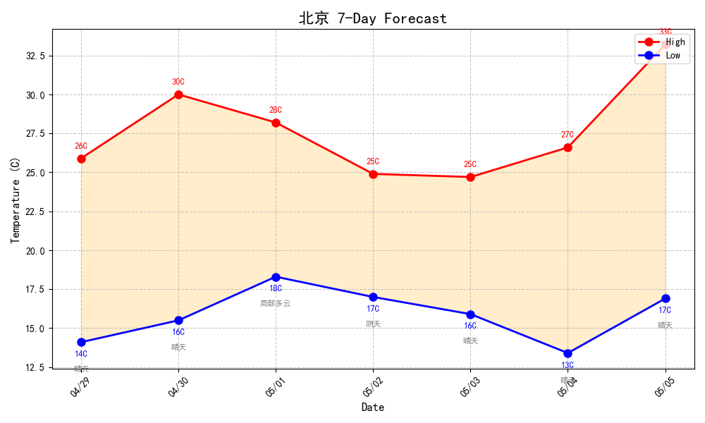

# Travel Agent - 智能天气穿搭助手

一个基于 Python 的命令行智能助手，可查询天气、推荐穿搭、并生成天气趋势图表。

## 功能特性

- **天气查询** - 支持全球城市实时天气及 7 天预报
- **智能穿搭推荐** - 基于温度规则的固定标准 + LLM 润色，生成精准穿搭建议
- **趋势图表** - 生成 7 天温度趋势折线图并保存为 PNG
- **大模型闲聊** - 支持基于 LLM 的自然语言对话
- **多轮对话上下文** - 智能记忆用户提到的地点，如"我是上海人"后说"天气怎么样"会自动用上海

## 项目结构

```
travel_agent/
├── agent.py          # 主程序入口（对话引擎）
├── weather.py        # 天气数据获取模块
├── outfit.py         # 穿搭推荐逻辑模块（温度规则）
├── chart.py         # 天气图表生成模块
├── llm.py           # LLM 闲聊模块（流式输出）
├── requirements.txt  # Python 依赖
├── .env.example     # 环境变量示例
├── weather_charts/  # 生成的天气趋势图
└── README.md       # 项目说明文档
```

## 环境要求

- Python 3.8+
- 需要网络连接

## 安装

```bash
pip install -r requirements.txt
```

## 配置

在环境变量中设置 API Key（推荐使用 `.env` 文件）：

```bash
# Windows
set WEATHER_API_KEY=你的天气API密钥
set LLM_API_KEY=你的LLM API密钥

# Linux/Mac
export WEATHER_API_KEY=你的天气API密钥
export LLM_API_KEY=你的LLM API密钥
```

- **天气 API**: [WeatherAPI.com](https://www.weatherapi.com) 注册获取免费密钥
- **LLM API**: [LuckyAPI](https://luckyapi.chat) 获取 API 密钥

## 运行

```bash
python agent.py
```

## 使用示例

```
========== Travel Agent ==========
Hello! I'm your weather & outfit assistant.
Ask me about weather/outfits or just chat!

Type "quit" to exit.

=================================


You: 北京天气怎么样

  🔄 正在分析用户问题，提取城市名...
  ✓ 城市名提取 → 北京

  🔄 正在连接天气API，获取 北京 的天气数据...
  ✓ 天气API响应 → 晴天 25.3°C

  🔄 正在生成7天天气趋势图...
  ✓ 趋势图生成 → ./weather_charts\北京_20260429.png

  🔄 正在生成穿搭建议...

北京今天天气不错，晴朗舒适，温度25.3°C。建议穿短袖或薄长袖，配长裤或裙子，运动鞋很合适。记得带太阳镜，阳光较强哦！未来一周北京以晴天为主，温度适中，很适合户外活动。

  📊 趋势图已保存：./weather_charts\北京_20260429.png


You: 我是上海人

  🔄 正在思考...

你好！很高兴认识你，上海的朋友！我是Travel Agent，很高兴为你服务。我可以帮你解答天气问题、穿搭建议，也可以和你日常闲聊。有什么我能帮你的吗？


You: 那边天气怎么样？

  🔄 正在分析用户问题，提取城市名...
  ✓ 城市名提取 → 上海

  🔄 正在连接天气API，获取 上海 的天气数据...
  ✓ 天气API响应 → 小雨 10.1°C

  🔄 正在生成7天天气趋势图...
  ✓ 趋势图生成 → ./weather_charts\上海_20260429.png

  🔄 正在生成穿搭建议...

您好！上海今天有小雨，温度10.1°C，体感9.4°C。建议穿毛衣或卫衣，搭配厚长裤和靴子，别忘了带伞和围巾。最近天气变化较大，未来几天气温回升但仍有多云。

  📊 趋势图已保存：./weather_charts\上海_20260429.png
```

## 7 天天气预报表示例



## 支持的命令

| 命令 | 说明 |
|------|------|
| `北京天气怎么样` | 查询城市今日天气 |
| `上海明天穿什么` | 查询明日穿搭建议 |
| `东京一周天气` | 查询 7 天天气预报 |
| `我是上海人` → `那边天气怎么样？` | 多轮对话上下文感知 |
| `quit` | 退出程序 |

## 穿搭推荐规则（固定温度标准 + LLM 润色）

| 温度范围 | 上装 | 下装 | 鞋子 | 配件 |
|---------|------|------|------|------|
| >28°C | 短袖 | 短裤/薄裙 | 凉鞋/运动鞋 | 太阳镜、防晒霜 |
| 22-28°C | 短袖/薄长袖 | 长裤/裙子 | 运动鞋 | - |
| 15-22°C | 长袖/薄外套 | 长裤 | 运动鞋 | - |
| 5-15°C | 毛衣/卫衣 | 厚长裤 | 靴子 | 围巾 |
| <5°C | 羽绒服/厚外套 | 棉裤 | 棉靴 | 手套、帽子、围巾 |

## 技术架构

```
用户输入
    │
    ├── 非天气问题 → LLM 流式闲聊
    │
    └── 天气问题
            │
            ├── LLM 提取城市名（参考对话上下文）
            │           ↓
            ├── 天气 API 获取数据
            │           ↓
            ├── outfit.py 根据温度生成基础穿搭
            │           ↓
            ├── LLM 润色生成丰富建议
            │           ↓
            └── chart.py 生成 7 天趋势图
```

## 许可证

MIT License
